# Projekt-IIS - Dopravní podnik
Jednoduchá webová aplikácia informačného systému pre mestskú dopravu (manažment a vyhladávanie spojov).

## Autori
**Filip Roman** - <xroman16@stud.fit.vutbr.cz> - vedúci, backend, výpomoc s frontendom, dokumentácia

**Nikolas Nosál** - <xnosal01@stud.fit.vutbr.cz> - frontend, dizajn aplikácie, výpomoc s backendom, testovanie

**Samuel Zima** - <xzimas01@stud.fit.vutbr.cz> - backend, výpomoc s frontendom, video dokumentácia, nasadenie aplikácie

## Inštalácia

### Softwarové požiadavky
Systém je testovaný pre PHP 8.1, Laravel Framework 10, Livewire 3 a MySQL 8.

### Spustenie aplikácie lokálne

1. Inštálácia Laravelu .
    - `composer global require "laravel/installer"`
2. Pridaj Laravel medzi premenné prostredia aby sme k nemu malí prístup globálne.
3. Inštalácia chýbajúcih balíčkov.
    - `composer install && composer update`
4. Inštálácia knižnice Livewire. 
    - `composer require livewire/livewire`
5. Spustenie aplikácie.
    - `php artisan serve`

### Postup inštalácie na server
Ako server sme použili hosting portal InfinityrFree. Tu je postup inštalácie:

1. Skopíruj priečinok **IS_app/public** do priečinku **htdocs/** na server infinityfree.
2. Skopíruj všetky súbory a priečinky z lokálneho priečinku **IS_app** okrem priečinku public do priečinku **htdocs/IS_app** na server infinityfree.
3. Na infinityfree zmeň v súbore **htdocs/index.php** '..' cestu k pričinku IS_ap' vo funkciách skriptu.
4. Ak existuje tak odstráň súbor **config.php** v priečinku htdocs/IS_app/bootsrap/cache/.
5. Zmeň nastavenia databázi v súbore **.env** podľa databázi infinityfree.

### Konfigurácia a inicializácia databázi
1. Vytvorenie tabuliek databázy + naplnenie tabuliek prvotnými dátami
    - `php artisan migrate`
2. Zaplnenie databázy základnými dátami
    - `php artisan db:seed`
3. Vytvorenie celého SQL súboru z migrácii
    - `mysqldump -u username -p database_name output_file_name.sql`
    tento vygenerovaný súbor sa premiestni do databázy na infinityfree

### Uživatelia systému pre testovanie
Existující zástupcovia všetkých rolí uživateľov.

| Login                       | Heslo      | Role          |
|-----------------------------|------------|---------------|
| root@dpmb.cz                | root       | Administrátor |
| jan.novak@gmail.com         | novak      | Správca       |
| jozef.dobry@gmail.com       | dobry      | Technik       |
| anna.neumannova@gmail.com   | neumannova | Dispečer      |
| frantisek.novotny@gmail.com | novotny    | Vodič         |

## Implementácia
Informačný systém sme implementovali pomocou frameworku Laravel 10 s knižnicou Livewire ktorá nám pomohla s tvorbou interaktívnej pomocou komponentov.
	
Ako databázový systém sme použili MySQL 8. Jednotlivé stránky sa skladajú z rôznych komponentov ktoré pomocou controllerov komunikujú s databázou, príjmajú uživateľský vstup, spracúvavajú ho a akualizujú modely.

### Správa uživateľov
Na pridávanie uživateľou používame komponentu **ManageUsersAdd** kde môžeme vytvoriť uživateľa a priradiť mu príslušnú rolu. Zoznam všetkých uživateľoch zobrazíme pomocou **ManagaeUsersList** kde následne administrátor môžeme upravovať profily a taktiež ich vymazať. 

Vymazať môžeme všetkých registrovaných uživateľov okrem administrátora a to len vtedy keď vymazaný uživateľ už nemá pridelené žiadne povinnosti, napr. údržbu vozidla, naplánovaný spoj a pod.. Heslá v zozname zašifrujeme kvôli bezpečnosti pomocou funkcie bcrypt().

### Vyhľadávanie spojov
Všetci uživatelia majú možnosť vyhľadávať spoje. Zoznam všetkých liniek a zastávok cez ktoré spoje prechádzajú si vieme zobraziť pomocou **HomeAddSearch**
na následne pomocou komponentu **HomeAddSearch** vyhľadať spoj ktorý prechádza cez uživateľom zvolenu zastávku v daný dátum a čas.

Po úspešnom vyhľadaní zastávky v plánovaných spojoch, sa nám zobrazí pomocou **SearchListDepartures** všetky aktívne spoje ktoré prechádzajú danou zastávkou v daný čas, taktiež si môžeme pozrieť zoznam nasledujúcih zastávok a čas odchodu zo zastávky. Taktiež môžeme znovu vyhľadať nový spoj pomocou **SearchAddSearch**.

| Užívateľ - Domovská stránka                      | Užívateľ - Vyhladávanie                       |Administrátor - Správa užívateľov                      |
| :----------------------------------------------: | :-------------------------------------------: |:----------------------------------------------------: |
| 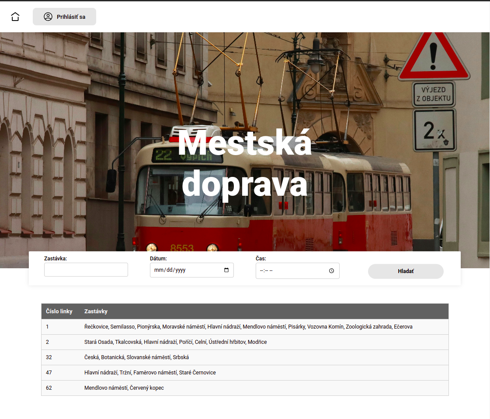 | 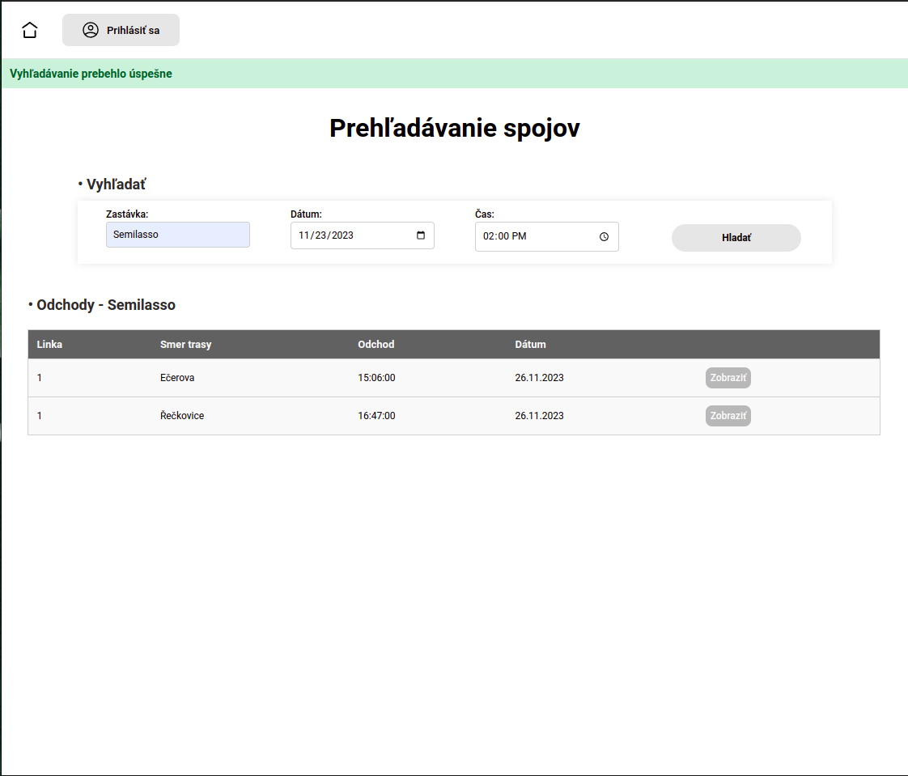  |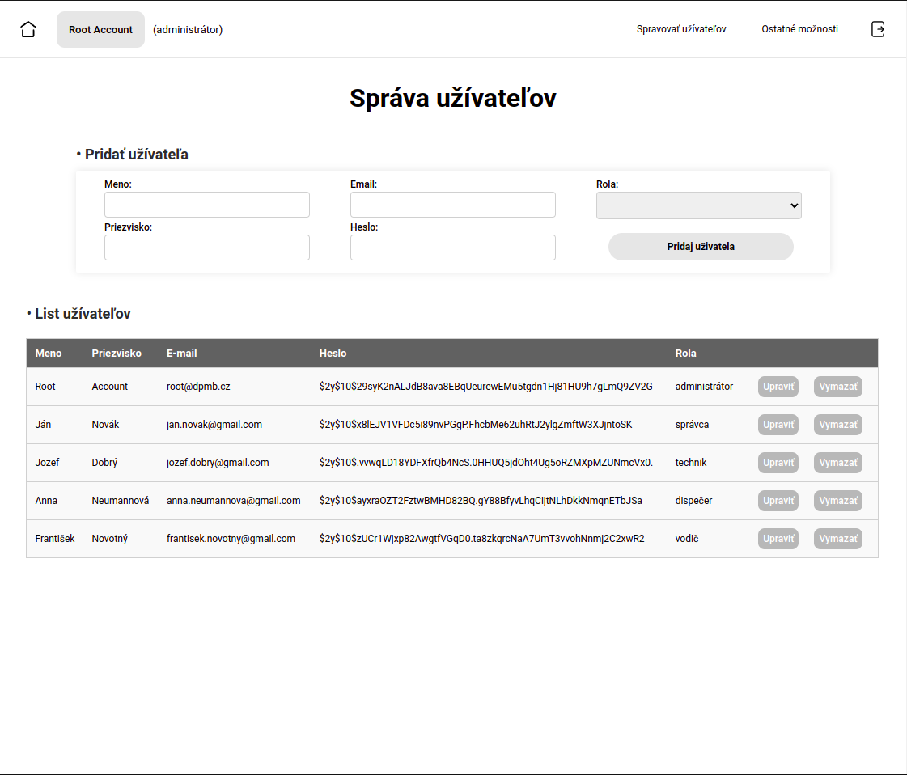 |

### Správa liniek a spojov
Informačný systém umožnuje správcovi spravovať spoje, to znamená že náš systém hormadnej dopravy sa skladá z liniek, zástávok a trás. Pomocou **ManageLinksAddStop** dokáže správca vytvárať zástavky, a následen prechádzať a upravovať existujúce zastávky pomocou **ManageLinksListOfStops**. 

Taktiež dokáže vytvárať **ManageLinksAddLine** nové linky a upravovať existujúce v **ManageLinksLinesList**. Pri odstránení určtej linky musí správca najpr vymazať alebo presmerovať trasy ktoré pôsobia na danej linke. Následne vytvorí trasu v **ManageLinksAddRoute** do kotrej priradí list zastávok cez ktoré prechádza a trasa sa priradí linke na ktorej bude premávať a tiež dokáže pomocou **ManageLinksListRoutes** upravať existujúcu trasu a upravovať a pridávať nové zástavky.

### Plánovanie spojov
Spoje sa v našom systéme vytvára správca. Spoj sa vytvára v **ScheduleRouteAdd** kde zadáme informácie o spoji ako trasa na ktorej bude premávať, čas, dátum od kedy do kedy bude tento spoj aktívny a taktiež či tento spoj bude premávať každý deň alebo iba výnimočno. Po vytvorení plánovaného spojo si môžeme pozrieť históriu naplánovaných spojov **ScheduleRouteListHistory** a tiež spravovať už naplánované spoje, to je upraviť a vymazať ich.

### Správa vozidiel
O správu vozidiel sa stará **ManageVehiclesAdd** kde môže správca pridávať nové vozidlá do systému, prezerať ich v **ManageVehiclesList** a taktiež ich spravovať.

### Plán údržby vozidiel a vytváranie záznamov o ich údržbe
Vozidlám správca plánuje ich údržbu v **OrganizeMaintenanceAdd** a priradí údržbu technikovi, ktorý následne vytvorí záznam o údržbre pomocou **RecordMaintenanceList**. Ďalej vieme prezerať a upraviť list aktívnych údrž **OrganizeMaintenanceListActive**, jej históriu **OrganizeMaintenanceListActiveHistory** a taktiež spravovať náhlásené závady v **OrganizeMaintenanceListRequest**.

| Správca - Správa liniek a spojov                       | Správca - Plánovanie spojov                                   | Správca - Správa vozidiel                                    | Správca - Plán údržby vozidiel                                         | 
| :----------------------------------------------------: | :-----------------------------------------------------------: | :----------------------------------------------------------: | :--------------------------------------------------------------------: |
| 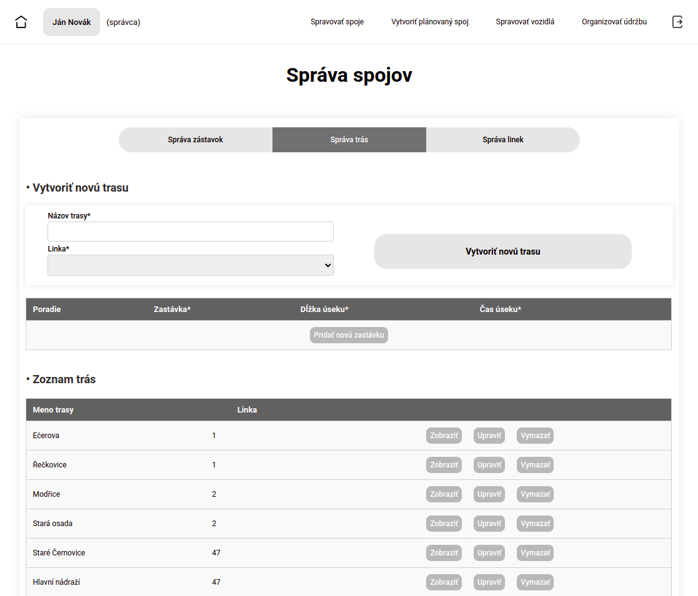 | 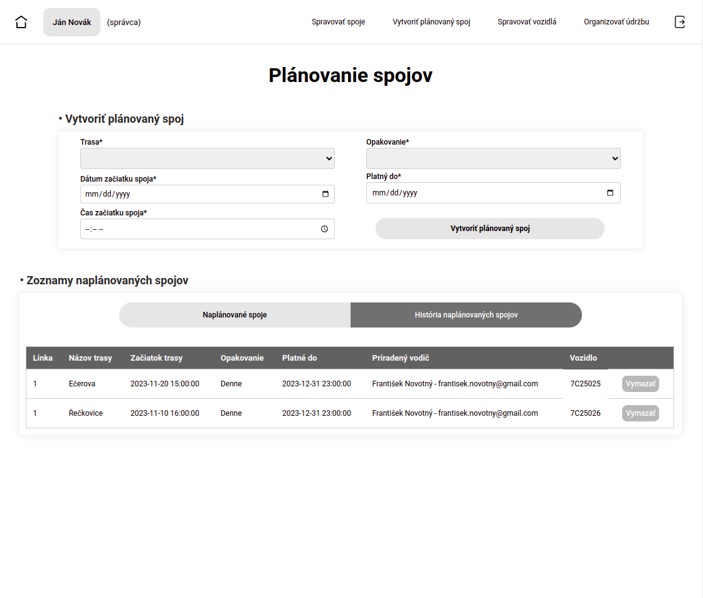  | 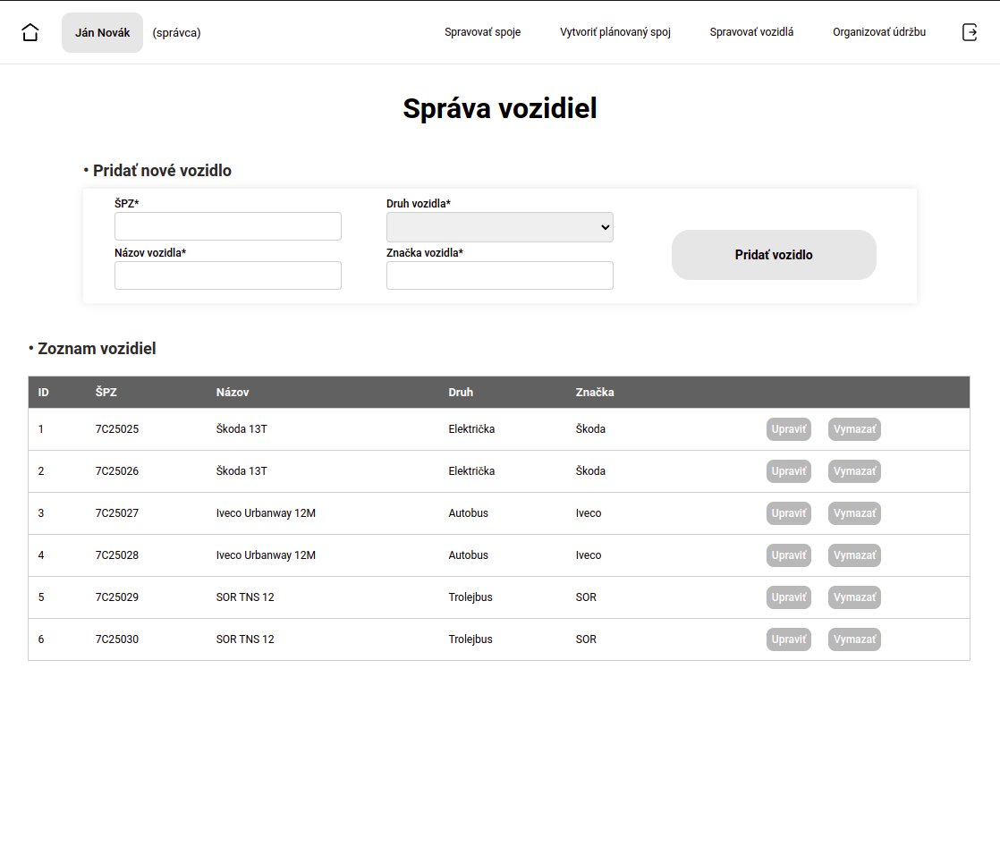 | 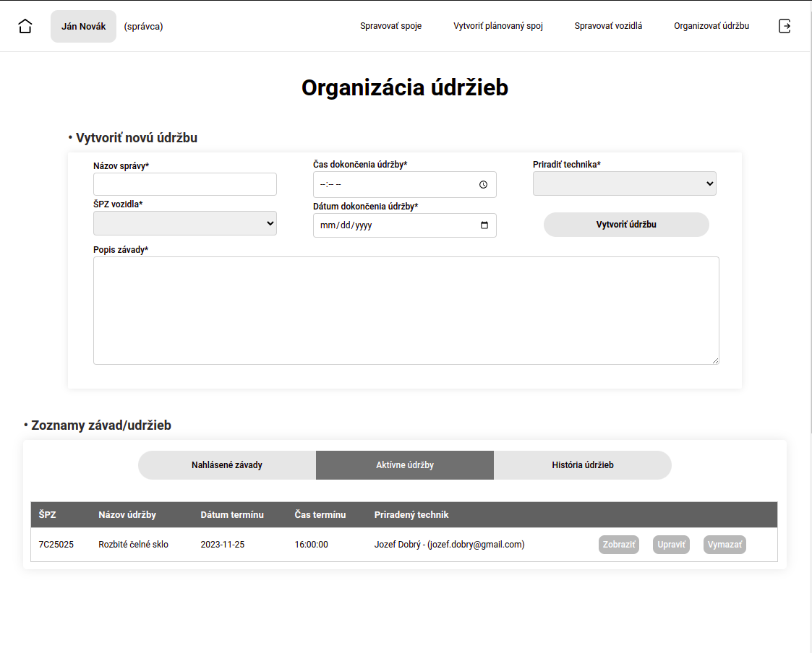 |

### Hlásenie závad
O hlásenie závad sa stara vodič, ktorý hlási všetky závadi **ReportIssueAdd** ktoré si vie následen správca pozrieť v **OrganizeMaintenanceListRequest** a priradiť novu údržbu pre poškodené vozidlo. 

### Plán pre vodičov
Vodiči si dokážu pozrieť svoj plán služby v **AssignedPlan** ktorý mu vytvoril dispečer, vie si tam vyhľadať kedy mu je priradený spoj a taktiež aké vozidlo je mu pre daný spoj priradené. 

| Vodič - Priradený plán                                   | Vodič - Nahlásiť závadu vozidla                          | Technik - Záznam údržieb                                          | Dispečer - Správa dispečinku                                 |
| :------------------------------------------------------: | :------------------------------------------------------: | :---------------------------------------------------------------: | :----------------------------------------------------------: |
| 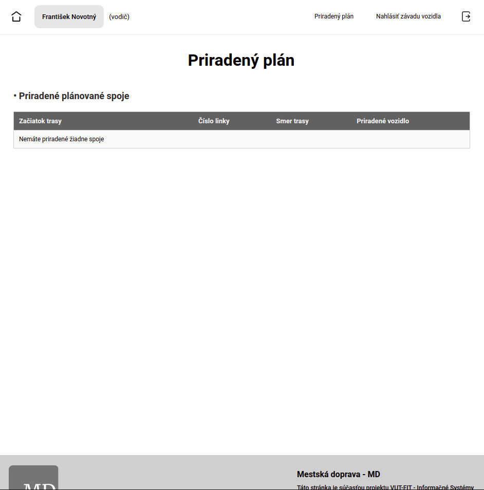 | 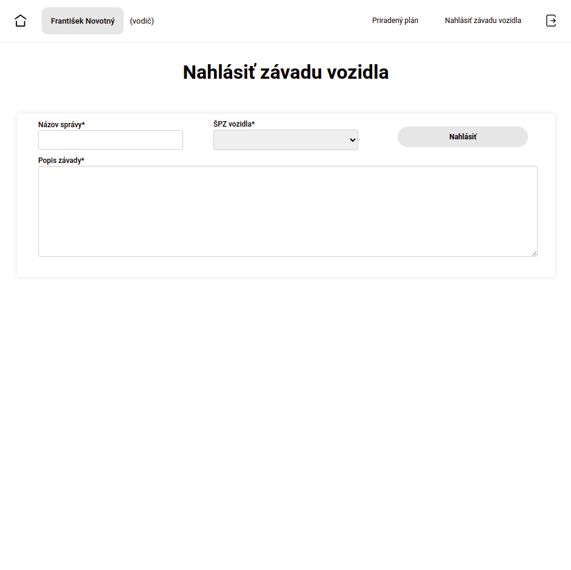  | 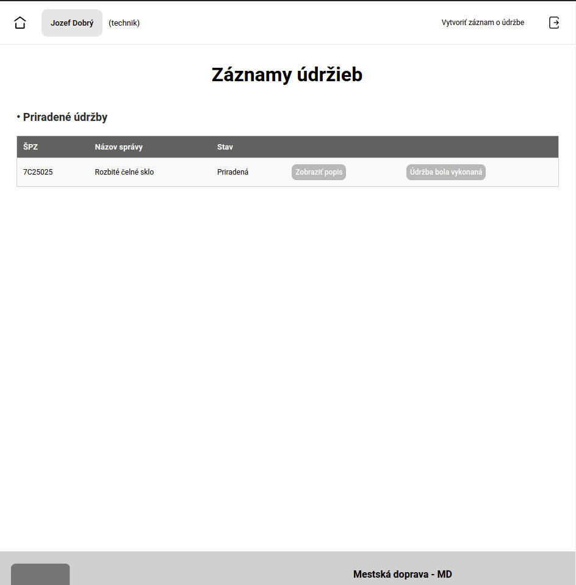 | 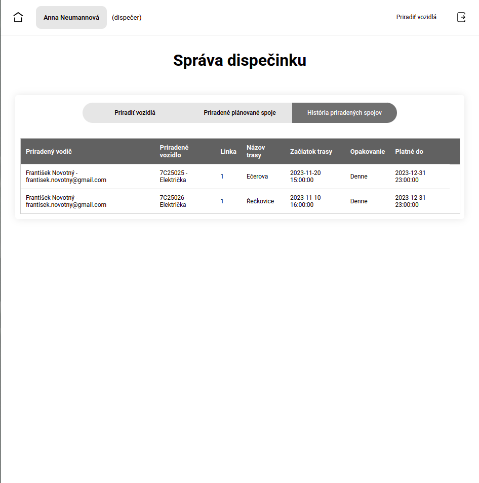 |

## Databáza
Grafická schéma relačnej databázi:

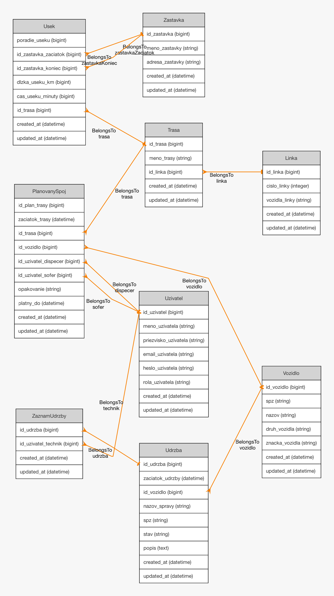